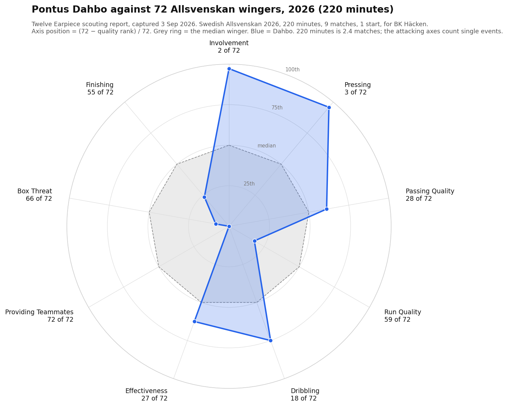

# Pontus Dahbo — scouting read on 220 minutes

**Assembled 3 September 2026.** Sources and method are at the foot of this file. The vendor
report this mirrors is a Twelve Earpiece scouting report on the **2026 Allsvenskan, 220 minutes**
— the part of Dahbo's season before he moved to Vitesse. A separate vendor (MyGamePlan) covers
the **2025** season, 1,308 minutes. Neither covers a minute at Vitesse.

> **The organising fact of this file: 220 minutes is 2.4 matches.** Every rank below is a rank
> among 72 wingers on 2.4 matches of one player. The ranks built on frequent events (touches,
> defensive actions) carry some information. The ranks built on rare events (key passes, shots,
> expected goals) are counts of zero, one or two, and a rank on a count of zero is a description
> of role and minutes, not of ability. **His 72 of 72 on Providing Teammates is zero key passes in
> 220 minutes, most of them off the bench.** Say that before saying anything else about him.

---

## 1. Header

| | |
|---|---|
| Player | Pontus Dahbo |
| Born | 11 October 2005 (20) — Earpiece |
| Nationality | Sweden |
| Strong foot | Left — Earpiece. Played on the right: an inverted winger |
| Height | 1.85 m — Transfermarkt |
| Agency | Global Soccer Management — Earpiece |
| Club in the report | BK Häcken, Allsvenskan (a calendar-year league; 2026 was in progress when he left) |
| Move | To Vitesse, **13 August 2026**. Transfermarkt lists it as a **loan**, contract to **June 2027**, market value **€2.00m** — Transfermarkt's figure, not the club's; the Earpiece report itself gives "Estimated value: Unknown" |
| Vitesse so far (to 3 Sep) | **123 minutes**: two substitute appearances, then a first start at Den Bosch on 28 Aug (64 minutes) — **as a central midfielder** (independent model's data; `CURRENT-SQUAD.md` had 59 minutes to match 3) |

**The vendor season line, verbatim:** Swedish Allsvenskan 2026 · Minutes 220 · Matches 9 ·
From start 1 · Goals 0 · Assists 0 · Yellow 1 · Red 0.

**The vendor headline:** *"20-Year-Old Winger for Häcken Showcases Strong Involvement and
Pressing, Yet Lacks Box Threat and Assists."*

## 2. Positions played (Earpiece, share of 221 minutes)

| Position | Minutes | Share |
|---|---:|---:|
| Right winger | 163 | 74% |
| Striker | 39 | 18% |
| Left winger | 12 | 6% |
| Other | 7 | 3% |

The vendor's "main position" bucket is *Winger, 175 minutes*; the 72-player comparison pool is
wingers. **Vitesse have used him on the right wing off the bench and then centrally from the
start.** MyGamePlan benchmarked his 2025 season as an *attacking midfielder*. Three different
positional frames for one player in three documents; the Earpiece ranks apply to the winger frame
only.

## 3. Strengths and weaknesses (Earpiece quality rank of 72 wingers)

| Strengths | rank | Weaknesses | rank |
|---|---:|---|---:|
| Involvement | **2** | Run Quality | 59 |
| Pressing | **3** | Box Threat | 66 |
| Dribbling | 18 | Providing Teammates | **72** |

## 4. Radar

| Facet | rank of 72 | implied percentile | what the rank rests on at 220 minutes |
|---|---:|---:|---|
| Involvement | 2 | 97 | ~27 defensive actions, ~113 touches — the most solid rank in the report |
| Pressing | 3 | 96 | ~26 intensity events, ~9 interceptions, ~3 high recoveries |
| Passing Quality | 28 | 61 | xT on passes: continuous, but dragged to 72/72 on zero chance-creating passes |
| Run Quality | 59 | 18 | ~3 box receptions, ~1 box entry from a carry |
| Dribbling | 18 | 75 | a success rate on roughly ten dribbles |
| Effectiveness | 27 | 63 | a mix; two of its metrics are top-two on denominators of near zero |
| Providing Teammates | 72 | 0 | zero key passes, zero xA, zero deep completions |
| Box Threat | 66 | 8 | ~4 box touches; the vendor's own zone map says "insufficient data" |
| Finishing | 55 | 24 | ~5 shots, none on target (xGOT 0.0); vendor zone map again says insufficient data |

Implied percentile = (72 − rank) / 72. Event counts are the vendor's per-90 rate × 2.44, rounded;
the vendor's rates are possession-adjusted, so the counts are approximate.

**The radar reads as a player with two elite facets and one absent one. At this sample it is a
player who did a lot of defending and touched the ball a lot, and had not yet created a chance.**
The first is a fair reading of ~140 events. The second is a reading of zero events.

---

## 5. Facet by facet

Each section: the vendor's table (metric · value · rank of 72 · glossary definition, shortened),
the vendor's zone read in one sentence, and our note. Values are per 90, possession-adjusted,
unless the glossary says otherwise.

### 5.1 Involvement — 2 of 72

| Metric | Value | Rank | Definition |
|---|---:|---:|---|
| Defensive actions won | 11.1 | **1** | successful duels, tackles, interceptions, recoveries, clearances, adjusted by opponent possession |
| Touches | 46.36 | 19 | open-play touches in possession |
| xGBuildup | 0.52 | 6 | xG of possessions he touched, excluding his own shots and shot assists |
| Aerials | 1.22 | 43 | aerial duels |

Vendor zone read: *"Dominant and skilled on the right wing"* — strong on both the defensive and
attacking right wing, below average centrally and on the left.

**Our note.** This is the facet the sample can support. Eleven defensive actions won per 90 is
about 27 in 220 minutes — enough events for the rank to mean something, and it is first of 72.
Touches at 46 per 90 is a real volume for a winger. The "below average centrally" sentence rests
on 39 minutes as a striker and 7 as "other"; ignore it. The vendor prose says he is "contributing
to goal-scoring opportunities" — xGBuildup 6/72 supports that in the vendor's own terms, though
0.52 per 90 is about 1.3 xG of possessions across the whole sample, so it is a handful of moves.
Aerials 43/72 at 1.85 m is worth a look when there are minutes to look at.

### 5.2 Pressing — 3 of 72

| Metric | Value | Rank | Definition |
|---|---:|---:|---|
| Defensive intensity | 10.66 | **1** | defensive duels, loose-ball duels, interceptions, tackles and fouls out of possession |
| High recoveries | 1.33 | 4 | recoveries in the attacking half |
| Interceptions | 3.55 | 10 | interceptions |
| Counterpressing actions | 0.89 | **40** | defensive actions within 5 s of a turnover |

Vendor zone read: *"Defensive disruptor excelling on the right wing"* — exceptional intensity on
the defensive right wing.

**Our note.** The second facet the sample can carry: ~26 intensity events, ~9 interceptions. The
prose says "relentless drive to recover the ball" and "intercept passes" — both are in the table.
What the prose leaves out is the fourth row: **counterpressing is 40 of 72, the median**. His
pressing rank comes from intensity and high recoveries, not from the five seconds after a
turnover. That distinction matters for Vitesse (§7). High recoveries at 1.33 per 90 is about three
events; hold that rank loosely.

### 5.3 Passing Quality — 28 of 72

| Metric | Value | Rank | Definition |
|---|---:|---:|---|
| Passes into final third (xT) | 0.07 | 14 | xT of passes into the final third |
| Crosses (xT) | 0.05 | 20 | xT of successful crosses |
| Passes in final third (xT) | 0.26 | 23 | xT of open-play passes inside the final third |
| Passes (xT) | 0.4 | 24 | xT of non-set-piece passes |
| Chance creating passes | 0.0 | **72** | assists + key passes + shot assists + second assists |

Vendor zone read: *"Excels in providing assists from the right wing"* — outstanding passing on the
attacking right wing and both right half-spaces; falters centrally and on the left.

**Our note.** The prose ("delivers passes into the final third… lacks the creativity") matches the
table: 14/72 on passes into the final third, 72/72 on chance-creating passes. **The zone-map
headline does not match the table.** "Excels in providing assists" sits above a row that says zero
assists, zero key passes, zero shot assists and zero second assists. The zone map is scoring
location-weighted xT of ordinary passes; the headline is machine-written over it. Quote the table,
not the headline. Four of the five rows here are continuous xT sums and sit between 14th and 24th:
**a passer around or above the median winger, with nothing yet in the final act.**

### 5.4 Run Quality — 59 of 72

| Metric | Value | Rank | Definition |
|---|---:|---:|---|
| Ball runs (xT) | 0.08 | 29 | xT of progressive and high-speed runs with the ball |
| Carries (xT) | 0.13 | 35 | xT of ball carries |
| Through ball receptions (xT) | 0.0 | 46 | xT of through-ball receptions |
| Box entries from carries | 0.38 | 60 | carries into the penalty area |
| Box receptions | 1.13 | 68 | pass receptions inside the opponent's box (× 0.5, possession-scaled) |

Vendor zone read: *"Strong attacking presence with effective right wing runs"* — carries the ball
into dangerous positions on the attacking right.

**Our note.** Two of the five rows are median (runs 29, carries 35), which is where the continuous
metrics land. The facet rank comes from the two box rows: about one box entry from a carry and
about three box receptions in the whole sample. The prose says he "doesn't consistently receive
the ball in critical attacking situations"; "consistently" is not a word 2.4 matches earns. Read
this as: **on the ball he carries at a median rate; he has not been a box-arriving winger in these
minutes.** Whether that is him or Häcken's use of him is not in the data.

### 5.5 Dribbling — 18 of 72

| Metric | Value | Rank | Definition |
|---|---:|---:|---|
| Pressure resistance % | 0.87 | **3** | share of successful actions under pressure in the first two thirds |
| Dribble success % | 0.89 | 14 | successful ÷ total dribbles |
| Dribbles (xT) | 0.09 | 26 | xT of successful dribbles |
| xGDribble | 0.06 | 36 | xG of shots within 5 s of his dribbles |

Vendor zone read: *"Outstanding right-wing attacker creates threats and beats defenders"* —
takes on defenders on the attacking right.

**Our note.** The prose is faithful: resists pressure (3/72), beats his man (14/72), does not turn
it into chances (36/72). An 89% success rate is eight of nine or sixteen of eighteen; the vendor
does not print the denominator. Pressure resistance at 87% is the more interesting number for
Vitesse (§7), and as a share of *all* actions under pressure it is drawn from a larger count than
the dribble rows. Still 220 minutes.

### 5.6 Effectiveness — 27 of 72

| Metric | Value | Rank | Definition |
|---|---:|---:|---|
| Low turnovers per low reception | 0.0 | **1** | turnovers in own 40% ÷ receptions in own 40% |
| Recoveries per opponent possession | 0.04 | **2** | recovered possessions ÷ opponent possessions |
| Passes (xT) per 100 receptions | 1.09 | 23 | pass xT per 100 receptions |
| Carries (xT) per 100 receptions | 0.36 | 42 | carry xT per 100 receptions |
| xGChain per possession | 0.02 | 54 | xG of possessions he was in, per involvement |
| np xG per shot | 0.07 | 64 | non-penalty xG ÷ shots |
| np xG + xA per 100 touches | 0.32 | 70 | (np xG + xA) per 100 touches |

No zone map printed for this facet.

**Our note.** Two ranks of first and second on this facet are artefacts of the sample. "Zero
turnovers per low reception" is a right winger who rarely received the ball in his own 40% and
did not lose it the few times he did; the denominator is small and the numerator is zero.
Recoveries per opponent possession is the same ball-winning signal as §5.1 restated. The bottom
three rows are the same absence as §5.7 and §5.8 restated per touch. **np xG per shot 0.07 (64/72)
is about five shots**; it is the one row here that would matter to Vitesse's stated problem, and
it is unreadable at five shots.

### 5.7 Providing Teammates — 72 of 72

| Metric | Value | Rank | Definition |
|---|---:|---:|---|
| xGCreated | 0.22 | 30 | xG of shots within 5 s of his passes |
| Second assists | 0.0 | 30 | last action before a teammate's assist |
| Assists | 0.0 | 51 | assists |
| Deep completions | 0.0 | 70 | non-cross completions within 20 m of goal |
| Key passes | 0.0 | **72** | passes that immediately create a clear chance |
| xA | 0.0 | **72** | expected assists |

Vendor zone read: *"Skilled chance creator on right wing needs to diversify game"* — remarkable
chance creation from the attacking right wing; below average in the half-spaces and centrally.

**Our note.** This is the facet to be plainest about. **Four of the six rows are 0.0. The rank of
72 is a count of zero key passes and zero xA in 220 minutes, 175 of them as a winger and most of
them off the bench.** It is not a measurement of creativity; it is a statement that the event has
not happened yet. Reconciling the one non-zero row: xGCreated 0.22 per 90 (30/72) is about 0.5 xG
across the sample — one or two of his passes were followed by a shot within five seconds, but none
was graded a key pass. Both are consistent with one or two events. And the zone-map headline —
"skilled chance creator" — contradicts every row beneath it; it is the same machine-written
mismatch as §5.3. Use the table.

A rank of 51 on zero assists means 21 other wingers in the pool also have zero: the pool itself is
full of small samples in a calendar-year league read in early September.

### 5.8 Box Threat — 66 of 72

| Metric | Value | Rank | Definition |
|---|---:|---:|---|
| np xG | 0.15 | 54 | non-penalty xG |
| np Goals | 0.0 | 56 | non-penalty goals |
| Box entries from carries | 0.38 | 60 | carries into the box |
| Touches in box | 1.51 | 67 | non-set-piece touches in the opponent's box |
| Box receptions | 1.13 | 68 | pass receptions inside the box |

Vendor zone read: *"Limited data hinders analysis of player's scoring potential"* — insufficient
xG data across zones.

**Our note.** The vendor itself declines to read this facet by zone for want of data. The facet
rank is about four box touches and ~0.4 xG across the sample. The right sentence is the vendor's
own: limited data. Note the direction anyway, because it is the same direction as 2025 (§6): low
goal output is the one attacking fact both seasons agree on.

### 5.9 Finishing — 55 of 72

| Metric | Value | Rank | Definition |
|---|---:|---:|---|
| np Goals − np xG | −0.4 | **37** | goals minus xG (a season total, not per 90) |
| np Goals | 0.0 | 56 | non-penalty goals |
| np Shot conversion % | 0.0 | 56 | goals ÷ shots |
| xGOT | 0.0 | 70 | xG on target |

Vendor zone read: *"Insufficient data limits effective shot zone analysis."*

**Our note.** The headline — *"Misses scoring chances regularly, needs improved shooting
accuracy"* — is not what the table says. His finishing residual of −0.4 ranks **37 of 72, the
median**: relative to the pool he has neither over- nor under-finished. What is low is the volume:
xGOT of 0.0 means none of his roughly five shots was on target. Five shots is not "regularly". This
dossier's own test (`VITESSE-ON-PITCH.md` §6) found player finishing residuals persist at r = +0.045
across full seasons; over 220 minutes the residual is not information at all.

---

## 6. Two seasons, two vendors — what is consistent and what is not knowable

| | 2025 Allsvenskan (MyGamePlan) | 2026 Allsvenskan (Twelve Earpiece) |
|---|---|---|
| Minutes · apps | 1,308 · 23 | 220 · 9 (1 start) |
| Goals · assists | 1 · 2 | 0 · 0 |
| Positional frame | attacking midfielder | winger (74% right) |
| Rating | MGC 6.66 v a 6.93 attacking-mid comparator | no composite; nine facet ranks |
| Ball-winning | top three among Allsvenskan attacking midfielders on possession gains | defensive actions won 1/72, defensive intensity 1/72, pressing 3/72 |
| Distribution | top three on distribution (MyGamePlan's term) | pass xT rows 14th–24th |
| Creation | 2 assists in 1,308 min (0.14 per 90) | 0 key passes, 0 xA |
| Goals | 1 in 1,308 min (0.07 per 90) | 0; ~0.4 np xG |

**Consistent across both:** he wins the ball at a rate that puts him at the top of his positional
pool in Sweden, in both seasons and on both vendors' definitions; he distributes at or above the
median; and his goal output is low — **one goal in 1,528 Allsvenskan minutes across the two
seasons**, about 0.06 per 90. Those three things survive the change of vendor, of season and of
positional frame.

**Not knowable from either:** whether he creates. Two assists in 1,308 minutes is modest; zero in
220 is a count. Neither sample says he is a creator, and neither is large enough to say he is not
one. Also not knowable: anything about level. The MGC comparator is an attacking-midfield
benchmark and the Earpiece pool is wingers; the two rankings cannot be laid on top of each other,
and neither is Eerste Divisie.

The MyGamePlan sample is six times the Earpiece sample. **Where the two disagree, weight 2025.**
Where they agree — ball-winning, low goals — the agreement is worth more than either alone.

---

## 7. Fit to Vitesse

**Caveats first, in the order they matter.** 220 minutes. A different league. A different
position — the ranks are among wingers; Vitesse started him in central midfield. A loan, on
Transfermarkt's listing, so the question is the option, not the player's ceiling. He is 20 in a
recruitment method (`VITESSE-ON-PITCH.md` §7) that targets 25-to-29 and buys on NPxG per 90, and
he is Scandinavian, which the same method favours. One of three criteria met; the third (chance
quality) is unreadable on five shots.

**What the profile would be for, if it holds.** Vitesse's 2025-26 profile is a compact mid-block
that presses less than its opponents (PPDA 12.14 against 9.78, Wyscout), attacks directly and by
cross, and has two measured weaknesses in transition and creation:

| Vitesse 2025-26 (Twelve season report) | rank of 20 | Dahbo's relevant Earpiece rows |
|---|---:|---|
| Possession retained after a recovery | **19th** | pressure resistance 87% (3/72); low turnovers 0.0 (1/72, tiny denominator) |
| Counter-pressing | 14th | counterpressing actions 0.89 (**40/72**, median) |
| np xG per shot | **19th** | np xG per shot 0.07 (64/72, ~5 shots) |
| Chief creator, Tahaui, departed | 10 assists in 2,943 min, 4th-best creator in the division | 0 key passes in 220 min; 2 assists in 1,308 min in 2025 |

Three readings, each with its limit:

1. **Retention after recovery is the one Vitesse weakness his profile speaks to.** A player who
   wins the ball (1/72) and then keeps it under pressure (3/72) is the description of the thing
   Vitesse do worst — the ball going straight back after a recovery. This is the strongest fit
   argument available and it rests on ~27 defensive actions and one pressure-resistance share.
2. **Do not sell him as a counter-presser.** His counterpressing row is the median. Vitesse's
   14th on counter-pressing is not what his pressing rank addresses; his rank comes from
   intensity and high recoveries. In a side that presses less than its opponents by design,
   an intense presser is either a change of approach or a player asked to do less of what the
   data says he does most. Which one is a coaching question, not a data one.
3. **Nothing in either vendor says he replaces Tahaui.** Tahaui's 10 assists came from 2,943
   minutes; Dahbo has 2 in 1,528 across two seasons. The creativity gap Vitesse opened in the
   summer is not closed by this signing on any evidence in hand, and the Earpiece 72/72 is
   neither evidence that it cannot be nor evidence that it can.

**The central-midfield start.** Vitesse used him at Den Bosch as a central midfielder, which is
closer to MyGamePlan's frame (attacking midfielder; top three on possession gains and
distribution) than to Earpiece's (winger). Earpiece's zone maps say he was below average centrally
at Häcken — from 39 minutes as a striker and 7 as "other", which is nothing. **If Vitesse see a
ball-winning, distributing central player, the larger 2025 sample is the one that supports that
reading, and it is also the frame in which his ranks are highest.**

**What the next 600–800 Vitesse minutes must show**, in order:

1. **Does the ball-winning survive the league?** Defensive actions won and defensive intensity at
   or above the top quartile of Eerste Divisie players in his position. This is the claim both
   seasons make; it is the first to test and the first that could fail.
2. **Any chance creation at all.** Key passes and xA above zero, at a rate that can be stated. At
   ~10 matches a key-pass rate starts to be a number; before that it is not.
3. **Shot quality against the team's.** Vitesse's np xG per shot was 0.109; his 2026 figure was
   0.07 on five shots. Whether he shoots from better positions than the side he has joined is the
   §7 criterion, and it needs 20 or more shots to read.
4. **Where he plays.** Right wing or central midfield. The vendor pools, and the fit argument,
   change with the answer.
5. **The loan terms.** Ask what the option is and what it costs. `CURRENT-SQUAD.md` §4 already
   says ask what he cost; the answer tests everything §7 says about how this club buys.

---

## 8. What not to say

- Not "the worst creator of 72 wingers". Zero key passes in 220 minutes is zero events.
- Not "misses chances regularly". Five shots, and a median finishing residual.
- Not "€2.00m". Transfermarkt's figure; the vendor prints "Unknown"; never quote a value at a club.
- Not any Earpiece rank without "of 72 wingers, on 220 minutes". The pool and the sample are the
  meaning of the number.
- Not "the vendor says he excels at providing assists". The vendor's zone-map headline says that;
  the vendor's table says zero. The table wins.

---

## Sources and method

- **Twelve Earpiece scouting report**, Pontus Dahbo, Winger, Swedish Allsvenskan 2026:
  `https://earpiece.twelve.football/reports/93c8e9cb-e369-4f14-905f-28214fb45d38`. Captured
  3 Sep 2026 via the user's logged-in session as page text, verbatim, to
  `scratchpad/earpiece/dahbo-93c8e9cb.txt`. All facet ranks, metric values, prose, zone-map
  sentences and the glossary are from this capture. The report was dated 03 Sep 2026 by the
  vendor. Ranks are among 72 Allsvenskan wingers; values are per 90, possession-adjusted, except
  where the glossary states a ratio or a total.
- **MyGamePlan** player report, read 3 Sep 2026 (pp21–24 of the pack): 2025 Allsvenskan,
  1,308 minutes, 23 appearances, 1 goal 2 assists; MGC 6.66 against a 6.93 attacking-midfielder
  comparator; top three among Allsvenskan attacking midfielders on possession gains and
  distribution. Third-party rating, labelled as such.
- **Transfermarkt**: loan, contract to June 2027, value €2.00m, height 1.85 m, date of arrival
  13 Aug 2026 — as fetched for `CURRENT-SQUAD.md` (club id 499). Not authoritative; never quoted
  as fact.
- **Vitesse minutes and the Den Bosch start**: the independent model's data (Koetsier,
  `KKD2526.xlsx` at HEAD, which holds 2026-27), 123 minutes to 3 Sep; 59 minutes to match 3 per
  `CURRENT-SQUAD.md` §3.
- **Vitesse team ranks** (retention after recovery 19th, counter-pressing 14th, np xG per shot
  19th, of 20): Twelve season report 2025-26, as carried in the ClubOS site build. **Tahaui**
  10 assists / 2,943 min: `PLAYER-METRICS.md`; "fourth-best creator in the division":
  `VITESSE-BRIEF-MARK.md` §3.4. **PPDA and crossing profile**: Wyscout export,
  `VITESSE-ON-PITCH.md` §3. **Recruitment method**: `VITESSE-ON-PITCH.md` §7. **Player finishing
  persistence r = +0.045**: `VITESSE-ON-PITCH.md` §6.
- **Implied event counts** in §4 and §5 are the vendor's per-90 value × (220 ÷ 90 = 2.44),
  rounded. Because the vendor adjusts for possession they are approximate to within roughly
  ±20%; they are given to show the order of magnitude, not as counts.
- **Radar**: `charts/dahbo-radar.png`, from `scratchpad/dahbo_radar.py` (matplotlib 3.9.4).
  Axis position = (72 − rank) / 72. The vendor prints no numeric axis values; the ranks are the
  only quantitative statement of the radar in the capture.

## Appendix — vendor glossary, verbatim

- Aerials: Number of aerial duels.
- Assists: Number of assists adjusted by possession.
- Ball runs (xT): Accumulated location-based xT from progressive runs and high speed runs with the ball adjusted by possession.
- Box entries from carries: Number of ball carries into the penalty area adjusted by possession.
- Box receptions: Number of successful pass receptions inside the opponent's penalty area divided by the team's possession percentage and multiplied by 0.5.
- Carries (xT): Accumulated action-based xT from ball carries adjusted by possession.
- Carries (xT) per 100 receptions: Accumulated expected threat from carries compared to the number of receptions and multiplied by 100.
- Chance creating passes: Number of assists, key passes, shot assists, and second assists adjusted by possession.
- Counterpressing actions: Number of defensive actions within 5 seconds after a turnover adjusted by the opponent's possession.
- Crosses (xT): Accumulated action-based xT of successful crosses adjusted by possession.
- Deep completions: Number of successful non-cross passes into the area within 20 meters of the opponent's goal adjusted by possession.
- Defensive actions won: Number of successful defensive actions (defensive duels, sliding tackles, interceptions, recoveries, clearances) adjusted by the opponent's possession.
- Defensive intensity: Number of defensive duels, loose ball duels, interceptions, sliding tackles and fouls when out of possession adjusted by the opponent's possession.
- Dribble success %: The ratio between successful dribbles and total dribbles.
- Dribbles (xT): Accumulated location-based xT from successful dribbles adjusted by possession.
- High recoveries: Number of recoveries in the attacking half adjusted by the opponent's possession.
- Interceptions: Number of interceptions adjusted by the opponent's possession.
- Key passes: Number of passes that immediately create a clear goal-scoring opportunity for a teammate adjusted by possession.
- Low turnovers per low reception: Number of turnovers in own 40% of the pitch adjusted by possession compared to total number of ball receptions in own 40% of the pitch.
- Passes (xT): Accumulated action-based xT from non set-piece passes adjusted by possession.
- Passes (xT) per 100 receptions: Accumulated expected threat from non set-piece passes compared to the number of shots and multiplied by 100. [sic — "shots" in the vendor's text]
- Passes in final third (xT): Accumulated action-based xT from successful open play passes inside of the final third.
- Passes into final third (xT): Accumulated action-based xT from successful non set-piece passes into the final third.
- Pressure resistance %: Percentage of successful actions under pressure in the first or second thirds of the pitch.
- Recoveries per opponent possession: Number of recovered possessions divided by total number of opponent possessions.
- Second assists: Number of last actions of a player from a goalscoring team prior to an assist by a teammate adjusted by possession.
- Through ball receptions (xT): Accumulated action-based xT from through ball receptions adjusted by possession.
- Touches: Number of open play touches when in possession (passes, shots, carries, dribbles, touches) adjusted by possession.
- Touches in box: Number of non set-piece touches in opponent penalty area when in possession (passes, shots, carries, dribbles, touches) adjusted by possession.
- np Goals: Number of non-penalty goals adjusted by possession.
- np Goals - np xG: The difference between non-penalty goals scored and non-penalty expected goals.
- np Shot conversion %: Percentage of non-penalty shots that are goals.
- np xG: Accumulated non-penalty expected goals adjusted by possession.
- np xG + xA per 100 touches: The sum of accumulated non-penalty xG and xA divided by the number of touches and multiplied by 100.
- np xG per shot: Accumulated non-penalty xG compared to the number of shots.
- xA: Accumulated expected assists adjusted by possession.
- xGBuildup: Accumulated non-penalty xG for possessions in which a player is involved in at least one event, excluding shots and shot assists adjusted by possession.
- xGChain per possession: Accumulated non-penalty xG for possessions in which a player is involved in at least one event divided by total number of possession involvements.
- xGCreated: Accumulated xG of shots within 5s of passes in the same possession assigned to the passer adjusted by possession.
- xGDribble: Accumulated xG of shots within 5s of dribbles in the same possession assigned to the dribbler adjusted by possession.
- xGOT: Accumulated non-penalty expected goals on target adjusted by possession.
