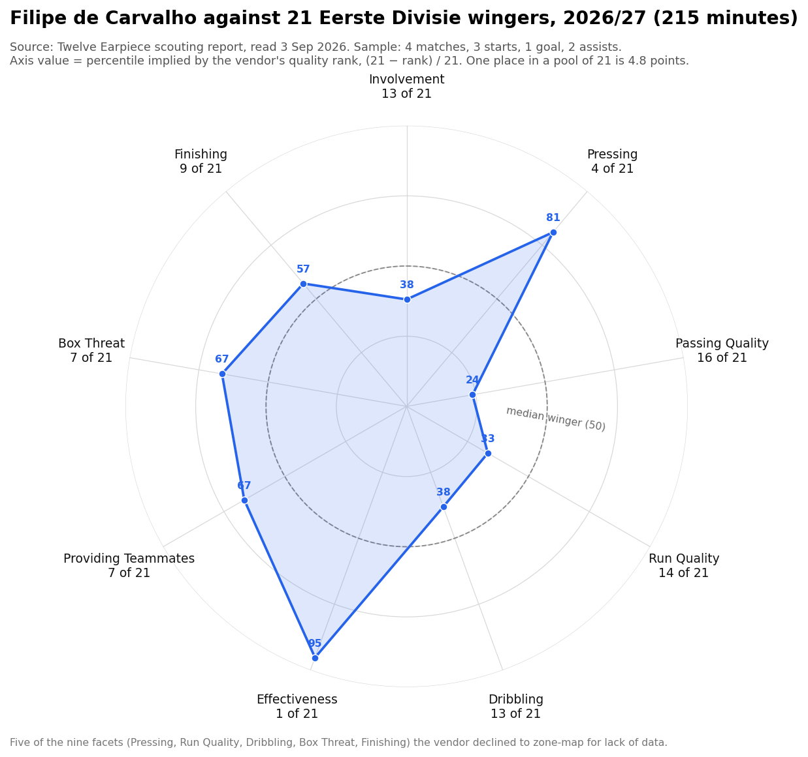

# Filipe de Carvalho — what 215 minutes can and cannot say

**Written 3 September 2026.** Primary source: the Twelve Earpiece scouting report on his Vitesse
minutes, captured from the vendor's page the same day (URL at the foot). The vendor's structure
is kept — header, positions, strengths and weaknesses, radar, one section per facet, glossary —
and every sentence of the vendor's prose is checked against the vendor's own table. Chart:
`charts/de-carvalho-radar.png`.

> ## Two facts organise everything below
> **1. The sample is 215 minutes.** Four matches, three starts, one goal, two assists. At per-90
> rates that is about four shots, eight receptions in the box, four counter-pressing actions and
> sixty-three touches. Nothing in this report is a performance finding. It is an early hypothesis
> with a date on which to test it.
>
> **2. The comparison pool is 21 wingers.** A rank of 21 moves 4.8 percentile points per place.
> One event — one more shot, one more interception — moves several places on most of these
> metrics. Several metrics rank a value of zero at 8th, 10th or 15th, which means a third to two
> thirds of the pool is also on zero. That is how thin the pool is this early in the season.

**The hypothesis this morning's reading produced, to be tested at 600–800 minutes:** a pressing
wide forward who finishes moves rather than builds them. He arrives in the box (box receptions
2 of 21), he counter-presses (1 of 21), he does not give the ball away in his own half (1 of 21),
and he does not carry or pass the ball forward (passes into the final third 18 of 21, touches
19 of 21). The vendor's prose calls him "well-rounded". The vendor's table says the opposite: a
spiky profile, three facets in the top seven and three in the bottom nine.

---

## 1. Header

| | Vendor (Twelve) | Other sources |
|---|---|---|
| Player | Filipe de Carvalho, winger | |
| Born | 1 Dec 2003 (22) | |
| Nationality | Portugal, Switzerland | |
| Club | Vitesse | Joined **21 Jul 2026** from FC Rapperswil-Jona; contract to **June 2028** (Transfermarkt) |
| Strong foot | **Right** | Transfermarkt lists him as a **left winger** |
| Agency | The Best of You Sports S.A. | |
| Value | "Estimated value €900,000" — **a vendor model number, never quoted as fact** | Transfermarkt **€250k** |
| Competition | Eerste Divisie 2026/27 | |
| Minutes / matches / starts | **215 / 4 / 3** | Independent model to 28 Aug: **210 minutes, started matches 2, 3 and 4**, 1 goal (at Den Bosch), 2 assists. `CURRENT-SQUAD.md` (to 24 Aug): 146 minutes, started 2 and 3 |
| Goals / assists | **1 / 2** | Agrees |
| Cards | 0 / 0 | |
| Prior sample | — | MyGamePlan: **213 min, 7 apps, 0G 0A**, Swiss Super League 2024-25, last appearance early December |

The two minute counts differ by five; the shape agrees — a substitute appearance in match 1
(v RKC), then three consecutive starts. His whole recorded sample at the top two tiers of any
league is about 430 minutes, and all three goal involvements are in the last 215.

**He has taken Hoogewerf's flank.** Hoogewerf (2,834 minutes, 8 non-penalty goals last season)
left in the summer; Tahaui (10 assists) left too. Those are the two holes; see §7.

## 2. Positions played

| Position | Minutes | Share |
|---|---:|---:|
| Right winger | 130 | 60% |
| Left winger | 65 | 30% |
| Central midfielder | 20 | 9% |
| *Main position: winger* | *195* | |

The vendor's minute total by position is 216 against 215 in the header; rounding. **Three
sources give three positions**: Transfermarkt says left winger, Twelve says 60% right, and he is
right-footed. Vitesse have used him mainly as an orthodox right-footed right winger — which, on a
crossing team, is the wing from which crosses come off the strong foot. On the left, for 65
minutes, he was an inverted winger. Which of the two Rehm settles on is the first thing to watch,
because the metrics below are pooled across both.

## 3. Strengths and weaknesses (vendor's, quality rank of 21 wingers)

| Strengths | Rank | Weaknesses | Rank |
|---|---:|---|---:|
| Effectiveness | **1** | Involvement | 13 |
| Pressing | **4** | Run Quality | 14 |
| Box Threat | 7 | Passing Quality | **16** |

*Vendor headline:* "22-Year-Old Winger at Vitesse: Effective Pressing and Box Threat with Growing
Involvement."

**Our note.** "Growing Involvement" is not something a single snapshot can measure, and the
report ranks Involvement 13th and lists it as a weakness. Read the six ranks as they are: the top
three rest on counting metrics of four to eight events and two ratio metrics with a numerator of
zero or one (§6.6); the bottom three rest on xT accumulations that total well under one unit of
threat across the whole sample (§6.3). Both halves are consistent with the same picture: a
low-touch player whose few touches happen near goal.

## 4. Radar — ranks, implied percentiles, and the pixel read

The vendor's page shows a nine-axis radar without printed values. The PDF print of the same page
was read by pixel earlier today (±1). Against the implied percentile, (21 − rank) / 21:

| Facet | Rank of 21 | Implied percentile | Pixel read | Difference |
|---|---:|---:|---:|---:|
| Effectiveness | 1 | 95.2 | ~95 | 0 |
| Pressing | 4 | 81.0 | ~81 | 0 |
| Providing Teammates | 7 | 66.7 | ~67 | 0 |
| Box Threat | 7 | 66.7 | ~67 | 0 |
| Finishing | 9 | 57.1 | ~57 | 0 |
| Involvement | 13 | 38.1 | ~38 | 0 |
| Dribbling | 13 | 38.1 | ~38 | 0 |
| Run Quality | 14 | 33.3 | ~33 | 0 |
| Passing Quality | 16 | 23.8 | ~24 | 0 |

**They agree on every axis.** The radar is therefore a plot of rank position in a pool of 21, not
a distribution-based score: it carries no information the ranks do not, and a change of one place
moves an axis by 4.8 points. Do not read the radar's *shape* as a profile of the player; read it
as where he stands in a queue of 21 after four matches.

## 5. The per-90 values as events

The glossary says every counting metric is "adjusted by possession". The goal (0.42) and the
assists (0.85) reproduce exactly at 215/90, so for this sample the adjustment is close to neutral
and the per-90 reading is safe to within rounding. What the report is actually built on:

| Metric | Per-90 value | Events in 215 minutes |
|---|---:|---:|
| Touches | 26.22 | ~63 |
| Defensive intensity (duels, interceptions, tackles, fouls) | 5.77 | ~14 |
| Box receptions | 3.38 | ~8 |
| Defensive actions won | 3.3 | ~8 |
| Touches in box | 2.96 | ~7 |
| Counter-pressing actions | 1.65 | ~4 |
| Interceptions | 1.65 | ~4 |
| Shots (np xG 0.86 ÷ 0.22 per shot; 25% conversion) | — | **4** |
| Key passes / chance-creating passes | 1.27 | 3 |
| Aerials | 1.25 | 3 |
| Assists | 0.85 | 2 |
| Non-penalty goals | 0.42 | 1 |
| Deep completions | 0.42 | 1 |
| Box entries from carries | 0.42 | 1 |
| High recoveries | 0.0 | 0 |
| Second assists | 0.0 | 0 |
| Accumulated: np xG 0.86 · xA 0.65 · xGCreated 0.86 · xGBuildup 1.55 · Passes (xT) 0.57 · Carries (xT) 0.17 | | |

**The one high-count metric is touches**, and it says he does not get many. That is the most
reliable statement in the report. Everything about finishing is four shots. Everything about
creation is three passes, two of which became goals.

---

## 6. Facets

Each facet: the vendor's table (metric · value · rank of 21 · glossary definition, shortened —
verbatim glossary in the appendix), the vendor's zone-map line, attributed, and our note. The
vendor **declined to zone-map five of the nine facets** — Pressing, Run Quality, Dribbling, Box
Threat and Finishing — for lack of data. Effectiveness has no zone map. Three were mapped:
Involvement, Passing Quality, Providing Teammates.

### 6.1 Involvement — quality rank 13 of 21

*Vendor:* "Playmaker proves crucial in central and right attacking zones / Build-up expert but
lacks defensive contribution." "Filipe de Carvalho shines in build-up play, showcasing his ability
to create chances for his teammates. However, he struggles to get involved in terms of touches on
the ball and his defensive contribution is also standard at best."

| Metric | Value | Rank | Definition |
|---|---:|---:|---|
| Aerials | 1.25 | 12 | Aerial duels |
| Defensive actions won | 3.3 | 12 | Successful duels, tackles, interceptions, recoveries, clearances, per opponent possession |
| Touches | 26.22 | **19** | Open-play touches in possession |
| xGBuildup | 0.65 | **2** | np xG of possessions he had an event in, excluding shots and shot assists |

*Vendor zone read:* "Exceptional in central attack, impressive on right offensive flank" —
outstanding in attacking central midfield, excelled on the attacking right wing, good on the
defensive right wing, below-average on the left.

**Our note — reconciling "shines in build-up" with 13 of 21.** The facet is four metrics; one is
2nd, one is 19th, two are 12th, and the facet lands 13th. The 2nd is xGBuildup, which is not a
measure of building play: it is the xG of possessions he *touched at any point*, minus the shot
and the shot-assist. A player with 63 touches who is in the move when it reaches the box will
score well on it without having built anything — and the Passing Quality table below confirms
that he does not build (passes into the final third 18th, passes xT 17th). **"Playmaker" and
"build-up expert" are not supported by the table. "Struggles to get involved in touches" is the
one well-founded sentence in the section, and it is the one the headline drops.** The zone read
says his involvement is in the attacking central and right-wing zones and not on the left: read
with the 60/30 position split, that is where he was played, not where he chose to go.

### 6.2 Pressing — quality rank 4 of 21

*Vendor:* "High-intensity counterpresser with room for improvement in interceptions / Relentless
presser but struggles with interceptions." "An aggressive and relentless presence in the press …
exceptional intensity and effectiveness in counterpressing situations. However, his ability to
make interceptions and recover the ball high up is noticeably lacking."

| Metric | Value | Rank | Definition |
|---|---:|---:|---|
| Counterpressing actions | 1.65 | **1** | Defensive actions within 5 s of a turnover, per opponent possession |
| Defensive intensity | 5.77 | **3** | Defensive duels, loose-ball duels, interceptions, tackles, fouls out of possession |
| High recoveries | 0.0 | 15 | Recoveries in the attacking half |
| Interceptions | 1.65 | 16 | Interceptions |

*Vendor zone read:* "Insufficient data prevents thorough defensive assessment."

**Our note.** The prose matches the table. Counter-pressing 1st and intensity 3rd are about four
and fourteen actions; high recoveries is zero, and **zero ranks 15th, so at least six other
wingers in the pool are also on zero**. Pressing volume is a counting metric with more events than
anything shot-based and is among the quicker to settle, but four matches against four opponents
with different possession shares is still four matches. What the facet *can* support: he presses
immediately after Vitesse lose the ball, at a rate at the top of this pool. What it cannot: that
he wins it. The vendor declined to zone-map this facet; we do not either.

### 6.3 Passing Quality — quality rank 16 of 21

*Vendor:* "Effective crosser but lacks passing precision / Exceptional crosser but struggles with
final third passing." "Solid ability, particularly in his crossing, which stands out among his
peers … his overall passing quality is not as strong."

| Metric | Value | Rank | Definition |
|---|---:|---:|---|
| Chance creating passes | 1.27 | 17 | Assists + key passes + shot assists + second assists |
| Crosses (xT) | 0.09 | 8 | xT of successful crosses |
| Passes into final third (xT) | 0.02 | **18** | xT of non-set-piece passes into the final third |
| Passes in final third (xT) | 0.19 | 13 | xT of open-play passes inside the final third |
| Passes (xT) | 0.24 | 17 | xT of all non-set-piece passes |

*Vendor zone read:* "Dangerous creator on the right, less impactful defending" — stands out on the
attacking right wing; diminishes in wider defensive areas and inside the opposition box.

**Our note.** "Stands out among his peers" describes an 8th of 21 on crosses; upper-middle, not
standout. The rest of the row is 13th to 18th, and the totals are tiny: 0.57 xT from all passes in
the sample, 0.05 from passes into the final third. **The facet cannot support any statement about
passing quality. It can support one about passing quantity: he does not move the ball forward.**
Note the contradiction with §6.1's "playmaker": chance-creating passes rank 17th here, and the
same three passes rank 9th as key passes in §6.7 — the difference is the pool's distribution on
two overlapping definitions, not two different players.

### 6.4 Run Quality — quality rank 14 of 21

*Vendor:* "Formidable in the penalty area but limited elsewhere on pitch / Penalty area threat but
lacks effective runs elsewhere." "Excels at receiving the ball in the penalty area … struggles
with making effective runs and creating danger from other areas."

| Metric | Value | Rank | Definition |
|---|---:|---:|---|
| Ball runs (xT) | 0.02 | **20** | xT from progressive and high-speed runs with the ball |
| Box entries from carries | 0.42 | 15 | Carries into the penalty area |
| Carries (xT) | 0.07 | **19** | xT from ball carries |
| Through ball receptions (xT) | 0.0 | 10 | xT from through-ball receptions |
| Box receptions | 3.38 | **2** | Successful pass receptions inside the opponent's box |

*Vendor zone read:* "Incomplete information limits assessment of player's ball-carrying skills."

**Our note.** The prose matches the table, and this is the facet that most clearly shows the
player. **Eight box receptions in 215 minutes, second in the pool; one carry into the box, 15th;
ball runs 20th of 21.** He is delivered to the box by teammates rather than carrying himself
there. Through-ball receptions at zero rank 10th — at least eleven of the pool are on zero. A
14th-place facet built on a 2nd and a 20th is the spiky profile again; the average conceals the
only two things the facet can say.

### 6.5 Dribbling — quality rank 13 of 21

*Vendor:* "Steady dribbler lacking impact yet manages good possession / Solid dribbler but lacks
creativity in final third." "Consistently manages to beat defenders with a reasonable success rate
… lacks the impact of creating significant chances from his dribbles."

| Metric | Value | Rank | Definition |
|---|---:|---:|---|
| Dribble success % | 1.0 | **1** | Successful ÷ total dribbles |
| Dribbles (xT) | 0.04 | 14 | xT from successful dribbles |
| Pressure resistance % | 0.8 | 8 | Successful actions under pressure in the first two thirds |
| xGDribble | 0.0 | 17 | xG of shots within 5 s of his dribbles |

*Vendor zone read:* "Insufficient data prevents proper evaluation of dribbling skills."

**Our note.** "A reasonable success rate" is 100%. The number of dribbles is not given; a 100%
rate ranking 1st with 0.10 xT accumulated and no shot within five seconds of any of them says the
count is small and none went anywhere. **The facet cannot be read at all until the count is
known**, which is why the vendor declined to zone-map it. Pressure resistance 80% (8th) is the
one figure with a plausible denominator.

### 6.6 Effectiveness — quality rank 1 of 21

*Vendor:* "Exceptional at creating and converting scoring opportunities." "His playmaking ability
shines through … creates chain plays that lead to threats … impressive conversion rate … slightly
less impactful in winning the ball back and in other aspects of build-up play. Overall, he is a
highly effective winger with a well-rounded skill set."

| Metric | Value | Rank | Definition |
|---|---:|---:|---|
| Carries (xT) per 100 receptions | 0.33 | 15 | Carry xT ÷ receptions × 100 |
| Low turnovers per low reception | 0.0 | **1** | Turnovers in own 40% ÷ receptions in own 40% |
| Passes (xT) per 100 receptions | 1.08 | 11 | Pass xT ÷ receptions × 100 |
| Recoveries per opponent possession | 0.01 | 15 | Recovered possessions ÷ opponent possessions |
| xGChain per possession | 0.05 | **1** | np xG of possessions he was in ÷ his possession involvements |
| np xG per shot | 0.22 | **4** | np xG ÷ shots |
| np xG + xA per 100 touches | 2.41 | **5** | (np xG + xA) ÷ touches × 100 |

*No zone map for this facet.*

**Our note.** This is the facet the headline strength rests on, and it is the one most exposed to
the sample. Every metric is a ratio. Two rank 1st: **low turnovers, which is a zero numerator** —
he did not give the ball away in his own 40% in however many low receptions a winger has in four
matches — and xGChain per possession, which is high because he is in few possessions and the
ones he is in end in shots. np xG per shot 0.22 is four shots. **np xG + xA per 100 touches (5th)
is the honest summary of the whole report: 1.5 units of threat from 63 touches — a lot of output
per touch, from very few touches.** "Well-rounded" is contradicted by the facet's own row (15th,
1st, 11th, 15th, 1st, 4th, 5th) and by the report's strengths/weaknesses spread of 1st to 16th.
"Slightly less impactful in winning the ball back" — 15th — is fair.

### 6.7 Providing Teammates — quality rank 7 of 21

*Vendor:* "Impressive assist provider but needs more diverse creative edge." "Shines as an assist
provider … his overall creative contributions are limited, particularly in deep completions and
second assists."

| Metric | Value | Rank | Definition |
|---|---:|---:|---|
| Assists | 0.85 | **2** | Assists |
| Deep completions | 0.42 | **19** | Non-cross completions into the area within 20 m of goal |
| Key passes | 1.27 | 9 | Passes creating a clear chance |
| Second assists | 0.0 | 8 | Last action before a teammate's assist |
| xA | 0.27 | 6 | Expected assists |
| xGCreated | 0.36 | 8 | xG of shots within 5 s of his passes |

*Vendor zone read:* "Proficient at creating chances from the right wing" — excellent xGCreated
from the attacking right wing and inside the opposition box; average in central midfield;
below-average from the half-spaces and left wing.

**Our note.** Prose matches table. **Two assists from 0.65 xA and three key passes: two of his
three chances created became goals.** That is the number that will not persist, and it is the
number the vendor's "impressive assist provider" is built on. xA 6th and xGCreated 8th are the
figures to hold him to; both say upper-middle. Deep completions 19th (one in the sample) and
second assists at zero (8th — thirteen of the pool on zero) repeat §6.3: he is the last touch or
the finisher, not the pass before. The zone read agrees with §6.1 and §6.3 — right wing and inside
the box, not the half-spaces.

### 6.8 Box Threat — quality rank 7 of 21

*Vendor:* "Reliable passer but struggles to carry into the box / Solid option hindered by limited
ball-carrying ability." "Excels in receiving passes within the penalty area … good in expected
goals and shows average performance in most other box threat metrics … does struggle with carrying
the ball into the box."

| Metric | Value | Rank | Definition |
|---|---:|---:|---|
| Box entries from carries | 0.42 | 15 | Carries into the penalty area |
| np Goals | 0.42 | 6 | Non-penalty goals |
| Box receptions | 3.38 | **2** | Pass receptions inside the opponent's box |
| Touches in box | 2.96 | 12 | Non-set-piece touches in the opponent's box |
| np xG | 0.36 | **4** | Non-penalty expected goals |

*Vendor zone read:* "Limited data makes performance analysis challenging."

**Our note.** The headline "Reliable passer" is not a box-threat statement and nothing in this
table concerns passing; the headline was generated from the wrong facet. The prose is otherwise
right. **The Summary's "does not stand out in box threat … average" contradicts the vendor's own
strengths list, where Box Threat is 7th and named a strength.** Box receptions 2nd and np xG 4th
(0.86 in 215 minutes, 0.36 per 90) are the two facts; touches in box 12th with receptions 2nd
means he receives and shoots or lays off rather than dwelling. Vendor declined the zone map.

### 6.9 Finishing — quality rank 9 of 21

*Vendor:* "Decent finishing hindered by low-quality chance creation / Adequate finisher lacks
chance creation skills." "Decent finishing ability, particularly in converting his shots at a
reasonable rate. However, he tends to struggle in generating high-quality chances."

| Metric | Value | Rank | Definition |
|---|---:|---:|---|
| np Goals − np xG | 0.14 | 10 | Goals minus xG |
| np Goals | 0.42 | 6 | Non-penalty goals |
| np Shot conversion % | 0.25 | **4** | Goals ÷ shots |
| xGOT | 0.07 | **16** | np expected goals on target |

*Vendor zone read:* "Limited data restricts evaluation of finishing ability."

**Our note — the prose has this backwards.** "Hindered by low-quality chance creation" is
contradicted by the vendor's Effectiveness table, where **np xG per shot is 0.22, 4th of 21: his
chances were good ones.** What is low is xGOT, 16th — 0.17 accumulated across the sample — which
is about where his shots went, not the chances he got. So the correct sentence is the reverse of
the vendor's: good chances, weakly struck, one of four scored. And all of it is four shots.
Finishing is the facet the dossier trusts least at any sample size (`VITESSE-ON-PITCH.md` §7:
conversion does not persist); at four shots it is not a facet.

---

## 7. What is actually known, and the fit to Vitesse

### What the table supports after 215 minutes

1. **He gets to the box without carrying the ball there.** Box receptions 2nd; carries into the
   box 15th; ball runs 20th.
2. **He counter-presses.** 1st on counter-pressing actions, 3rd on defensive intensity; zero high
   recoveries.
3. **He does not build play.** Touches 19th, passes into the final third 18th, passes xT 17th,
   deep completions 19th. The involvement facet's "playmaker" is an artefact of xGBuildup.
4. **He has not given the ball away in his own half** — a zero, shared with whoever else is on
   zero, and unmeasurable at this size.
5. **His output per touch is high and his touches are few.** np xG + xA per 100 touches 5th.

Everything else — finishing, dribbling, passing quality, the one goal, the two assists from
0.65 xA — is inside the noise of four matches. **The hypothesis: a pressing wide forward who
finishes moves rather than builds them.** Test it at 600–800 minutes, which on current usage is
mid-October to November, on the same five lines: box receptions, counter-pressing actions,
touches, passes into the final third, xA.

### Fit to the club's measured deficits

| Vitesse deficit (dossier team profile) | What the sample says | Weight |
|---|---|---|
| **Chance quality** — np xG per shot 19th of 20 | His np xG per shot 0.22, 4th of 21; box receptions 2nd | Right direction; four shots |
| **Retention after recovery** 19th; **counter-pressing** 14th | Counter-pressing 1st, intensity 3rd; retention in his own half at zero turnovers | Right direction; the pressing counts are the more stable of the two |
| **Lost wide scorer** — Hoogewerf, 8 np goals, 2,834 min | np xG 0.36 per 90; one goal; **he has taken that flank** | The role fits; the output is unproven |
| **Lost creator** — Tahaui, 10 assists | 2 assists from 0.65 xA; passes into final third 18th; deep completions 19th | **He is not that player.** He is the recipient of the final pass, not its source |

**What the club has already decided.** Signed 21 July, a substitute on 7 August, then started
matches 2, 3 and 4 in a side that otherwise changed one name between matches 2 and 3
(`CURRENT-SQUAD.md` §2). Three consecutive starts in a settled XI is a selection decision, not an
experiment, and it was made before any of these numbers existed. What the numbers add is a
description of the job he has been picked to do — and a warning about the one job (Tahaui's) he
has not been picked to do and the table says he does not do. If the club wants a creator from
deep on that side, it is a separate signing.

**On the method.** `VITESSE-ON-PITCH.md` §7: buy on NPxG per 90, not goals; give length; target
25–29. He is 22, on a contract to 2028, and arrived on a Transfermarkt value of €250k — length
was given. On the first rule, judge him on np xG, xA and box receptions, and ignore the goal and
the two assists until the sample is three times this size.

---

## Sources and method

- **Primary:** Twelve Earpiece scouting report, Filipe de Carvalho, Dutch Eerste Divisie
  2026/2027, `https://earpiece.twelve.football/reports/1972fc49-e69a-445d-a508-4b72b2fb3af3`,
  page text captured verbatim 3 Sep 2026 from the user's logged-in session; report dated
  03 Sep 2026 on its radar. Radar percentiles were read by pixel from the PDF print of the same
  page (±1) and reconciled against (21 − rank) / 21 in §4. All ranks are of 21 wingers in the
  vendor's pool; the pool's membership and minute threshold are not published.
- **Event reconstruction (§5):** per-90 value × 215/90, rounded. Validated on the goal and the
  assists, which reproduce exactly; the glossary's possession adjustment is therefore close to
  neutral for this sample.
- **Squad, minutes to 24 Aug, selection:** `CURRENT-SQUAD.md` (branch
  `docs/almere-recruitment-interviews`), Transfermarkt club id 499.
- **Minutes to 28 Aug, match-4 goal:** the independent xG model used across the dossier
  (Koetsier, `data/KKD2526.xlsx` at HEAD — see `DATA-SOURCES.md` §3b).
- **Prior sample:** MyGamePlan, read earlier on 3 Sep 2026.
- **Transfer, contract, value, listed position:** Transfermarkt. Values are never quoted at a club.
- **Team deficits and recruitment method:** `VITESSE-ON-PITCH.md` §7 and the dossier's Wyscout
  team profile.
- **Chart:** `charts/de-carvalho-radar.png`, matplotlib 3.9.4, dossier conventions
  (`pipeline/player_charts.py`). Script kept in the session scratchpad as `decarvalho_radar.py`.
- **Not asserted here:** the Den Bosch result; his dribble count; the pool's membership; anything
  about his Rapperswil-Jona minutes; the vendor's €900,000.

---

## Appendix — vendor glossary, verbatim

Aerials: Number of aerial duels.
Assists: Number of assists adjusted by possession.
Ball runs (xT): Accumulated location-based xT from progressive runs and high speed runs with the ball adjusted by possession.
Box entries from carries: Number of ball carries into the penalty area adjusted by possession.
Box receptions: Number of successful pass receptions inside the opponent's penalty area divided by the team's possession percentage and multiplied by 0.5.
Carries (xT): Accumulated action-based xT from ball carries adjusted by possession.
Carries (xT) per 100 receptions: Accumulated expected threat from carries compared to the number of receptions and multiplied by 100.
Chance creating passes: Number of assists, key passes, shot assists, and second assists adjusted by possession.
Counterpressing actions: Number of defensive actions within 5 seconds after a turnover adjusted by the opponent's possession.
Crosses (xT): Accumulated action-based xT of successful crosses adjusted by possession.
Deep completions: Number of successful non-cross passes into the area within 20 meters of the opponent's goal adjusted by possession.
Defensive actions won: Number of successful defensive actions (defensive duels, sliding tackles, interceptions, recoveries, clearances) adjusted by the opponent's possession.
Defensive intensity: Number of defensive duels, loose ball duels, interceptions, sliding tackles and fouls when out of possession adjusted by the opponent's possession.
Dribble success %: The ratio between successful dribbles and total dribbles.
Dribbles (xT): Accumulated location-based xT from successful dribbles adjusted by possession.
High recoveries: Number of recoveries in the attacking half adjusted by the opponent's possession.
Interceptions: Number of interceptions adjusted by the opponent's possession.
Key passes: Number of passes that immediately create a clear goal-scoring opportunity for a teammate adjusted by possession.
Low turnovers per low reception: Number of turnovers in own 40% of the pitch adjusted by possession compared to total number of ball receptions in own 40% of the pitch.
Passes (xT): Accumulated action-based xT from non set-piece passes adjusted by possession.
Passes (xT) per 100 receptions: Accumulated expected threat from non set-piece passes compared to the number of shots and multiplied by 100. [sic — "shots"]
Passes in final third (xT): Accumulated action-based xT from successful open play passes inside of the final third.
Passes into final third (xT): Accumulated action-based xT from successful non set-piece passes into the final third.
Pressure resistance %: Percentage of successful actions under pressure in the first or second thirds of the pitch.
Recoveries per opponent possession: Number of recovered possessions divided by total number of opponent possessions.
Second assists: Number of last actions of a player from a goalscoring team prior to an assist by a teammate adjusted by possession.
Through ball receptions (xT): Accumulated action-based xT from through ball receptions adjusted by possession.
Touches: Number of open play touches when in possession (passes, shots, carries, dribbles, touches) adjusted by possession.
Touches in box: Number of non set-piece touches in opponent penalty area when in possession (passes, shots, carries, dribbles, touches) adjusted by possession.
np Goals: Number of non-penalty goals adjusted by possession.
np Goals - np xG: The difference between non-penalty goals scored and non-penalty expected goals.
np Shot conversion %: Percentage of non-penalty shots that are goals.
np xG: Accumulated non-penalty expected goals adjusted by possession.
np xG + xA per 100 touches: The sum of accumulated non-penalty xG and xA divided by the number of touches and multiplied by 100.
np xG per shot: Accumulated non-penalty xG compared to the number of shots.
xA: Accumulated expected assists adjusted by possession.
xGBuildup: Accumulated non-penalty xG for possessions in which a player is involved in at least one event, excluding shots and shot assists adjusted by possession.
xGChain per possession: Accumulated non-penalty xG for possessions in which a player is involved in at least one event divided by total number of possession involvements.
xGCreated: Accumulated xG of shots within 5s of passes in the same possession assigned to the passer adjusted by possession.
xGDribble: Accumulated xG of shots within 5s of dribbles in the same possession assigned to the dribbler adjusted by possession.
xGOT: Accumulated non-penalty expected goals on target adjusted by possession.

*Glossary as captured from the Dahbo report of the same vendor and date; the de Carvalho page
states its glossary is identical.*
