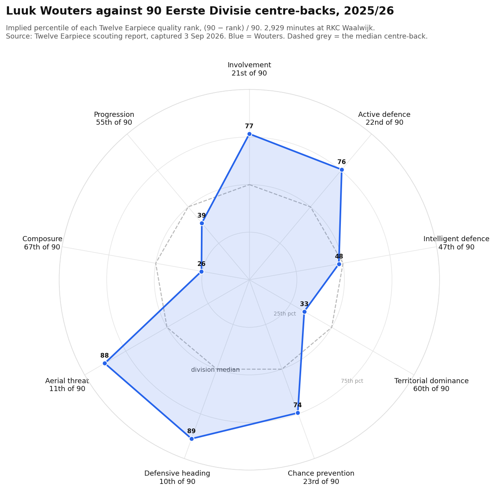

# Luuk Wouters — scouting report, read against the Vitesse dossier

**Written 3 September 2026.** Sources and how to reproduce are at the foot of this file.
This mirrors the structure of the vendor report it is built from, facet for facet, so the two
can be compared side by side. Every number below is the vendor's unless it says otherwise.

| | |
|---|---|
| Player | **Luuk Wouters**, born 8 June 1999 (27), Dutch, left-footed |
| Position | Central defender |
| Club | **Vitesse** — signed 31 August 2026, free from RKC Waalwijk, contract to 30 June 2028 (Transfermarkt). Every number in this report was produced at RKC. |
| Season and sample | Eerste Divisie 2025/26: **2,929 minutes, 33 matches, 32 starts.** 0 goals, 0 assists, 2 yellow cards. |
| Comparison pool | 90 Eerste Divisie central defenders, 2025/26 |
| Source | Twelve Earpiece scouting report, `earpiece.twelve.football/reports/776769c6-9315-4940-9d6b-b3ddddf9a09a` |
| Captured | 3 September 2026, page text after full load, from the user's own account |

> ## Verdict: a left-sided centre-back who wins the header and the tackle at a top-ten rate and does very little with the ball — which is the specification `VITESSE-ON-PITCH.md` §3 wrote, and it comes with a penalty-box caveat the vendor's own zone read raises.
> **Aerials won 69%, 2nd of 90. Tackles won 75%, 5th. 1v1s won 78%, 7th.** Against that,
> pressure resistance 70% (79th of 90) and opponents completing 79% of passes into his area
> (83rd). One season, one club, no persistence test possible.

Two things never to quote from the vendor page: the **€300,000 "estimated value"** is a model
output, not a fact; and **height** — Transfermarkt gives 1.84 m on the Vitesse page and 1.90 m
on the older RKC page, so neither figure is safe.

---

## 1. Overview

**Positions played** (vendor; the three rows sum to 2,930, the header says 2,929 — a rounding
difference in the vendor's own page, not worth pursuing):

| Position | Minutes | Share |
|---|---:|---:|
| Central defender | 2,534 | 86% |
| Left back | 327 | 11% |
| Other (one position, unnamed) | 69 | 2% |

**Strengths and weaknesses as the vendor ranks them** (quality rank of 90):

| Vendor's strengths | rank | Vendor's weaknesses | rank |
|---|---:|---|---:|
| Defensive Heading | **10** | Progression | 55 |
| Aerial Threat | **11** | Territorial Dominance | 60 |
| Involvement | 21 | Composure | **67** |

The vendor's summary paragraph says he is "excellent in both aerial threat and defensive
heading, boasting a high win percentage in aerial duels", "effective in active defence, winning
tackles and successfully defending in one-on-one situations", "struggles with composure under
pressure, evidenced by his low pressure resistance %", and that "his progression metrics are
average". **Every one of those four sentences is supported by the tables below.** The summary
is the most reliable prose on the page; the facet headlines are not, and §3 says where they go
wrong.

In the dossier's own data (`data/analysis/players_2025-26_enriched.csv`) he has **2,924
minutes, the 7th most of 67 qualified Eerste Divisie centre-backs**, 3 shots, 0.28 NPxG,
0.33 xA. The five-minute gap to the vendor's 2,929 is two providers counting stoppage time
differently.

---

## 2. The radar

Twelve draws a nine-axis radar of "quality ranks". The ranks were transcribed from the page;
the percentile column is implied, (90 − rank) / 90, and was checked this morning by pixel
against the printed Team Fit PDF, which matched on every axis.

| Facet (vendor's order) | Quality rank of 90 | Implied percentile |
|---|---:|---:|
| Involvement | 21 | 77 |
| Active Defence | 22 | 76 |
| Intelligent Defence | 47 | 48 |
| Territorial Dominance | 60 | 33 |
| Chance Prevention | 23 | 74 |
| **Defensive Heading** | **10** | **89** |
| **Aerial Threat** | **11** | **88** |
| Composure | 67 | 26 |
| Progression | 55 | 39 |

**The shape is the point: two clusters, not a rounded profile.** Five facets at the 74th
percentile or better, four at the 48th or worse, and nothing between. The five good ones are
all things done to the ball or to an opponent — heading, tackling, being involved, limiting
chances. The four weak ones are all things done with the ball or with space — composure,
progression, controlling territory, and the vendor's catch-all "intelligent defence".

---

## 3. The facets, one by one

Each table gives the vendor's metric, value and rank of 90, with the glossary definition cut to
one line (verbatim definitions are in Appendix A). Where the metric is "adjusted by possession"
the value is not a raw per-90 count and should not be multiplied out as one. **Where a
percentage is quoted, the number of events behind it is estimated from the vendor's own
counts** — that is the only way to judge how robust it is.

### 3.1 Involvement — rank 21 of 90

| Metric | Value | Rank | What it measures |
|---|---:|---:|---|
| Aerials | 2.98 | 63 | Number of aerial duels (a count; not possession-adjusted) |
| Defensive actions won | 10.34 | 27 | Successful duels, tackles, interceptions, recoveries, clearances, adjusted by opponent possession |
| Touches | 58.02 | 32 | Open-play touches in possession, adjusted by possession |
| xGBuildup | 0.54 | **12** | NPxG of possessions he touched, excluding shots and shot assists, adjusted by possession |

Vendor headline: *"Dominated games with left-side contributions and buildup play."* Zone read
(vendor): outstanding in both left half-spaces and on the left wing; struggled in the
opposition penalty area and across central and right-sided areas.

**Our note.** The prose says he "does fall short in aerial duels". **That sentence contradicts
the vendor's own Defensive Heading facet, where he is 10th of 90, and it is the single most
misleading line on the page.** The reconciliation is that *Aerials* is a count of duels
contested — 2.98 per 90, 63rd — while the heading facets score the share he wins, 69%, 2nd.
He contests fewer headers than most centre-backs and wins more of the ones he contests. The
low count is at least partly the team's: RKC conceded 12.24 shots a match, the fewest in the
division bar ADO, and 1.41 xG a match, second-fewest (dossier data, `q1_against.csv`). A
defence that concedes that little is not contesting many aerial balls in its own box. Read the
count as exposure, not ability.

The 12th-ranked xGBuildup is the one number here that is not obviously about defending, and it
is possession-adjusted. It says RKC's better possessions tended to pass through him. It does
not say he created them; the Progression facet (§3.9) says he did not.

### 3.2 Active Defence — rank 22 of 90

| Metric | Value | Rank | What it measures |
|---|---:|---:|---|
| **Defending 1v1s won %** | **78%** | **7** | Share of attempts that stop a dribbler getting past him |
| Defensive actions won | 10.34 | 27 | As above |
| Recoveries | 5.37 | 50 | Recoveries, adjusted by opponent possession |
| **Tackles won %** | **75%** | **5** | Share of defensive ground duels won, excluding loose-ball duels |

Vendor headline: *"Strong left-side defender with gaps on the right."* Zone read (vendor):
strong in the left half-space, excellent on the attacking left wing, average centrally, lacking
on the right side.

**Our note.** The prose ("excelling in both tackle and one vs. one situations") matches the
table. Note what it does not say: recoveries are exactly median (50th). He is a duel-winner,
not a ball-hoover. **The vendor gives no count for tackles or 1v1s, so the two percentages
cannot be sized** — a 75% tackle rate on 40 tackles and on 120 are different levels of
evidence, and the page does not say which this is. The headline's "gaps on the right" comes
from the zone map only; nothing in the table is split by side.

### 3.3 Intelligent Defence — rank 47 of 90

| Metric | Value | Rank | What it measures |
|---|---:|---:|---|
| Loose ball recoveries | 3.44 | 48 | Recoveries without an active defensive action, adjusted by opponent possession |
| Counterpressing actions | 0.83 | 44 | Defensive actions within 5 s of a turnover, adjusted by opponent possession |
| Interceptions | 4.57 | 44 | Interceptions, adjusted by opponent possession |

Vendor headline: *"Inconsistent performances limit defensive effectiveness across the field."*
Zone read (vendor): excelled winning possession on the attacking left wing, well in the
defensive left half-space, inconsistent in the defensive right half-space and central midfield.

**Our note.** Three metrics between 44th and 48th of 90 is the definition of median, and the
vendor's second headline for the same facet says exactly that ("reliable in defense but with no
standout qualities"). **The first headline's "inconsistent" is not supported by any number in
the table**; it is a description of the zone map, where the left reads well and the right
reads poorly — which is what a left-sided player's map looks like. Counterpressing at 0.83 per
match-equivalent is low in absolute terms, but it is ranked against other centre-backs and
sits at 44th, so the division's centre-backs are not counterpressing much either.

### 3.4 Territorial Dominance — rank 60 of 90

| Metric | Value | Rank | What it measures |
|---|---:|---:|---|
| Defensive area (m²) | 886.37 | 35 | Area covering 68% of his defensive actions, excluding final-third set pieces, adjusted |
| Defensive action height (m) | 32.01 | 55 | Mean distance up the pitch of his defensive actions, set pieces excluded |
| **Opp. pass success % into defensive area** | **79%** | **83** | Share of opponents' open-play passes into his area that are completed |
| Opp. xT into defensive area | 1.32 | 51 | Threat of the completed passes into his area, per 100 |

Vendor headline: *"Struggles to prevent opponent's passes into his defensive zone."* No zone
map was published for this facet.

**Our note.** This is the weakest single number on the page and the prose reads it correctly.
The prose's "decent defensive area" (35th) is fair; its "standard defensive action height"
(55th, 32 m from his own goal line) is generous — he defends slightly deeper than the median
centre-back. **The two facts belong together: a centre-back who acts 32 m out and lets 79% of
passes into his zone arrive is a centre-back in a block that concedes the pass and contests
what comes after it.** Whether that is his choice or RKC's instruction cannot be read off the
table. What can be read is that the passes that arrive do not carry much: the threat of those
passes is median (51st), and the next facet says the shots that follow are below par.

### 3.5 Chance Prevention — rank 23 of 90

| Metric | Value | Rank | What it measures |
|---|---:|---:|---|
| Opp. progressive passes from defensive area % | 14% | 72 | Share of opponents' passes *out of* his area that are completed, progressive and end in their attacking half |
| **Opp. xG after defensive action** | **0.33** | **18** | NPxG of shots within 8 s of his being the last defender to act, per 100 possessions entering his area |
| Opp. xG from defensive area | 0.57 | 23 | NPxG of shots fed by a completed pass from his area within 6 s, per 100 possessions entering it |
| Opp. xT from defensive area | 1.40 | 28 | Threat of opponents' completed passes out of his area, per 100 |

Vendor headline: *"Good at restricting chances but needs to block passes."* No zone map.

**Our note.** Prose and table agree. The three outcome measures — what opponents actually get
from his zone — are all top-30. The one process measure — how often they play a progressive
pass out of it — is 72nd. Same pattern as §3.4: **the passes go in and come out; the shots do
not follow.** These are per-100-possession rates, so they are partly normalised for how often
RKC's box was entered, but not for how RKC's block was organised around him. **RKC's 1.41 xG
conceded per match is the second-best in the division, and these numbers were produced inside
it.** They describe a player in a good defence; they do not isolate him from it.

### 3.6 Defensive Heading — rank 10 of 90

| Metric | Value | Rank | What it measures |
|---|---:|---:|---|
| Aerials won | 2.06 | 39 | Aerial duels won by first contact |
| **Aerials won %** | **69%** | **2** | Share of aerial duels won |
| Defensive aerials won | 1.90 | 27 | Aerial duels won in own 60% of the pitch, adjusted by opponent possession |
| **Defensive aerials won %** | **70%** | **6** | Share of aerial duels won in own 60% |

Vendor headline: *"Formidable aerial presence with notable defensive half-space dominance."*
Zone read (vendor): excelled in the defensive left half-space and defensive central midfield;
**struggled in his own penalty area** and in the attacking central-midfield zone.

**Our note.** The percentages are the two best numbers he has, and they are robust enough to
carry weight: 2.98 duels per 90 across 32.5 nineties is **roughly 95–100 aerial duels for the
season**, of which about 67 were won (the vendor's 2.06 per 90 × 32.5 = 67, which reconciles).
A 69% rate on a hundred contests is not a fluke of a few matches. The defensive share is on
about 88 duels.

Two things the prose adds that the table does not contain. "He primarily excels in crucial
moments" has no metric behind it anywhere on the page; treat it as decoration. And the zone
read that he **struggled in his own penalty area** is the one that matters for Vitesse, since
the penalty area is where corners land. The heading counts here are not stated to exclude set
pieces (the *defensive area* metrics explicitly do; the aerial metrics do not say). **So the
picture is: a centre-back who wins the header in the half-space and in front of the box, with
his weakest aerial zone being the six-yard-to-penalty-spot zone the corner problem lives in.**
The map itself was not captured; this rests on the vendor's sentence.

### 3.7 Aerial Threat — rank 11 of 90

| Metric | Value | Rank | What it measures |
|---|---:|---:|---|
| Aerials won | 2.06 | 39 | As above |
| **Aerials won %** | **69%** | **2** | As above |
| Attacking aerials won | 0.92 | 37 | Aerial duels won in the attacking 60%, adjusted by possession |
| **Attacking aerials won %** | **68%** | **2** | Share of attacking aerial duels won |
| Headed plays | 0.43 | 62 | Successful head passes or headed shots in the attacking half, adjusted |

Vendor headline: *"Strong defensive aerial presence."* Zone read (vendor): exceptional in the
defensive left half-space, well on the defensive left wing, diminished in attacking roles and
central midfield.

**Our note.** The facet's name overstates what it measures. Three of its five metrics are the
same aerial-duel figures as §3.6, and the two that are specific to attacking — 68% won and
0.43 headed plays — describe a player who wins the contest and then rarely does anything with
the ball. The attacking share is on **roughly 44 duels** (0.92 / 0.68 × 32.5), less than half
the defensive sample, so the "2nd of 90" is softer than the defensive "2nd of 90". **The
dossier's own data closes the question: 0 goals, 3 shots, 0.28 NPxG in 2,924 minutes.** A
centre-back who is a threat from corners does not finish a full season on three shots. He is
not a goal threat and no number on this page says otherwise; the vendor's own headline for the
facet, "strong *defensive* aerial presence", concedes it.

### 3.8 Composure — rank 67 of 90

| Metric | Value | Rank | What it measures |
|---|---:|---:|---|
| Low turnovers | 0.55 | 51 | Turnovers in own 40% of the pitch, adjusted by possession |
| **Ball losses** | **2.98** | **16** | Possession-ending actions of any kind, adjusted by possession |
| **Pressure resistance %** | **70%** | **79** | Share of successful actions under pressure in the first two thirds |
| Under-pressure retention | 1.23 | 59 | Successful actions under pressure in the first two thirds, adjusted |

Vendor headline: *"Inconsistent composure affects defensive retention under pressure."* Zone
read (vendor): good pressure resistance in defensive central midfield and the left half-space;
struggled on the defensive left wing; **particularly poor in his own penalty box and the right
half-space**.

**Our note.** The prose is right on both halves: he loses the ball rarely (16th) and copes with
pressure badly (79th). Those are consistent, not contradictory — a player who is pressed
seldom and moves the ball on early will lose it seldom and fail when he is pressed. **The
sample behind the 70% is small.** 1.23 successful under-pressure actions per 90 at a 70%
success rate implies about 1.76 pressured actions per 90, or **roughly 55–60 for the whole
season**. Ten more successes would move him from 79th to somewhere near the middle. This is
the least robust percentage on the page and the rank should be read as "bottom third, with a
wide error bar", not as 79th.

### 3.9 Progression — rank 55 of 90

| Metric | Value | Rank | What it measures |
|---|---:|---:|---|
| Ball progression (xT) | 0.13 | 53 | Threat added by progressive passes and carries ending in the opponent's half, adjusted |
| Passes into final third (xT) | 0.11 | 50 | Threat added by open-play passes into the final third |
| Playmaking passes | 8.34 | 40 | Progressive, smart, through and final-third passes completed, adjusted |

Vendor headline: *"Strong creative impact from the left despite wider struggles."* Zone read
(vendor): strong from both left half-spaces, solid from the attacking left wing, below average
on the right and in central midfield.

**Our note.** The headline and the prose disagree with each other. The headline says "strong
creative impact"; the prose, two lines below, says "average performance … doesn't stand out in
any specific area … reliable yet unremarkable". **The table sides with the prose**: 53rd, 50th,
40th. The headline is the zone map's left-side colouring rendered as a sentence. The dossier's
own threat figure for him (0.069 xT per 90, 152nd of 355 qualified players of all positions;
2.25 for the season) says the same thing: median.

### 3.10 The vendor's prose, audited

| Claim in the vendor prose | Supported by the table? |
|---|---|
| Summary: high aerial win %; wins tackles and 1v1s; low pressure resistance; average progression | **Yes, all four** |
| Involvement: "falls short in aerial duels" | **No** — a duel *count* (63rd) presented as a quality; the win rate is 2nd |
| Intelligent Defence: "inconsistent performances" | **No** — three metrics at 44th–48th; the vendor's own alternate headline says "no standout qualities" |
| Territorial: "standard defensive action height" | Partly — 55th, slightly deeper than median |
| Defensive Heading: "excels in crucial moments" | **No metric exists for it** |
| Progression headline: "strong creative impact" | **No** — 40th–53rd; the prose under it says "average" |
| Aerial Threat headline: "strong *defensive* aerial presence" | Yes — and it is the honest label for the facet |

---

## 4. Fit to Vitesse

**Read `VITESSE-ON-PITCH.md` §3 and `WYSCOUT-FULL-MINE.md` §3 and §5 first.** The short
version: Vitesse defend by shape, not pressure (PPDA 12.14 against their opponents' 9.78,
p = 0.038); they win the ground duel at both ends (defensive duels 63.9% v 61.1%) and lose the
air (**aerial duels 42.0% won against opponents' 45.8%** across 1,484 duels); they attack by
crossing into a box they do not win headers in; and the corner channel is the persistent hole.
§3 concludes that the aerial deficit is "a recruitment specification and not only a coaching
one". **Wouters is what that specification looks like when it is filled.**

### 4.1 The aerial axes against the mechanism

The mechanism is a *rate* problem — 42% against 46% — and his two best numbers are rates: 69%
of all aerial duels, 70% of defensive ones, on about a hundred contests. A centre-back winning
seven in ten replaces one of the men contributing to a squad winning four in ten. That is the
direct, arithmetical case, and it is the strongest thing in this report.

The caveat is where he wins them. The vendor's zone read for Defensive Heading has him
excelling in the left half-space and central midfield and **struggling in his own penalty
area**. Vitesse's aerial problem is most expensive in the penalty area, from corners: 8.28 xG
conceded from corners against ADO's 3.41 (`VITESSE-ON-PITCH.md` §3). At RKC, corners were a
disproportionate share of what little the defence conceded: **17.8% of RKC's xG against came
from corners, the second-highest share in the division** (dossier data, `q1_against.csv`,
Koetsier model). On corner xG conceded per match RKC rank 11th of 20 on that file; the
dossier's working figure elsewhere is 14th, on a different model. Either way, **the
second-best defence in the division was a mid-table corner defence, and its highest-ranked
aerial defender is the one arriving.** That is not proof he is the reason. It is a reason not
to assume he fixes the corner problem on his own.

### 4.2 The block he defended in, against Vitesse's

Both sides defend deep and concede little volume: RKC 12.24 shots and 1.41 xG a match, Vitesse
12.66 and 1.59. The xG-per-shot conceded differs — RKC 0.115, Vitesse 0.126, the latter 5th
highest in the division — so Vitesse's block leaks better shots. Wouters' chance-prevention
numbers (xG after his action 18th, xG from his area 23rd) are exactly the kind of number that
would improve that, *if* they are his and not RKC's. The per-100-possession normalisation
helps but does not settle it. **One season in one block is not enough to separate the player
from the system; the dossier's rule is that a finding is not a finding until it persists, and
there is nothing here to test persistence against.**

### 4.3 The weak axes, and why this block asks less of them

Composure 67th, pressure resistance 79th, opponents' pass completion into his area 83rd. In a
possession side those would be disqualifying. Vitesse are not one: 14.70 actions a minute
against 16.06, 3.51 passes per possession against 4.15, 14.2% long-pass share against 10.2%,
nine accurate smart passes in a season (`VITESSE-ON-PITCH.md` §3). **A side that plays 3.5
passes and goes long does not ask its centre-backs to hold the ball under pressure, and does
not ask them to step out and deny the entry pass** — the block concedes it by design. The
weak axes describe a player who does not do things this team does not do.

Where they would still bite:

- **In his own penalty box under pressure.** The Composure zone read is "particularly poor in
  his own penalty box". A deep block spends more of its time there than a high one, and a keeper
  who plays short to a pressed centre-back on the edge of the six-yard box is testing exactly
  the metric he is 79th on. That is a coaching instruction, not a recruitment error — but it is
  an instruction that has to be given.
- **If the block is asked to defend higher.** Defensive action height 32 m, 55th. Nothing in
  the on-pitch data says Rehm wants that, but it is a season-long habit and it goes the wrong
  way for a pressing side.
- **The right half-space.** Every zone read on the page — Involvement, Active Defence,
  Intelligent Defence, Composure, Progression — has him strong on the left and average-to-poor
  on the right. He is left-footed and covered 327 minutes at left back. **This is a
  left-of-the-pair centre-back, and the slot he takes matters more than for most signings.**
  If he is played right of the partner, none of the left-side evidence transfers. Which of the
  current pair (Achouitar and Zumberi have started all three matches, `CURRENT-SQUAD.md` §2) he
  is competing with is the question to ask, and this file does not know the answer.

### 4.4 The signing against §7's method

- **Age 27**: inside the 25–29 band §7 says the division underprices (27.3% of minutes against
  61.3% to under-23s).
- **Free**: consistent with a club whose permanent signings are 74% free.
- **Contract to 30 June 2028** (Transfermarkt, not the club's paperwork): two seasons, which is
  the shorter end of what §7 argues for. Whether an option exists is not public.
- **Chance quality**: §7's first rule is about attackers and does not apply. The equivalent for
  a centre-back — buy the rate, not the count — is what §3.6 above does.

### 4.5 What is not known

- **One season.** No prior-season Earpiece report was captured and the dossier's local data
  begins in 2025/26 for player metrics. The persistence test the dossier applies to every team
  finding cannot be applied to him. Aerial win rates on ~100 duels are the most stable thing
  here; pressure resistance on ~55 actions is the least.
- **The zone maps.** Every "left-side / right-side" sentence in this file is the vendor's
  prose description of a heatmap that was not captured as an image. The direction is stated
  consistently across seven facets, which is some reassurance; the magnitude is not known.
- **What he cost in wages** and whether the two-year term carries an option. Neither is public.

---

## Sources and reproduction

- **Primary source:** Twelve Earpiece scouting report for Luuk Wouters, Dutch Eerste Divisie
  2025/2026, report id `776769c6-9315-4940-9d6b-b3ddddf9a09a`, captured **3 September 2026** as
  page text after full lazy-load from the user's logged-in account. Verbatim capture at
  `scratchpad/earpiece/wouters-776769c6.txt` (session scratch, not committed). Every metric
  value, rank, headline and zone-read sentence above is transcribed from it. **Not captured:**
  the zone heatmap images, the radar image, and any prior-season report.
- **Percentile validation:** the printed Twelve "Team Fit" PDF, read by pixel on 3 September,
  gave Def Heading ~89, Aerial Threat ~88, Involvement ~77, Active Defence ~76, Chance
  Prevention ~74–75, Intelligent Defence ~48, Progression ~39, Territorial ~33, Composure ~26 —
  consistent with (90 − rank)/90 on every axis.
- **Transfer, contract, age:** Transfermarkt, Vitesse page (club id 499) and the older RKC
  page. The two pages disagree on height (1.84 m v 1.90 m); no height is quoted here.
- **Dossier data:** `data/analysis/players_2025-26_enriched.csv` (67 qualified centre-backs
  by `pos == 'Centre-Back'` and `qualified`; Wouters 2,924 minutes, rank 7 by minutes; 3 shots,
  0.283 NPxG, 0.325 xA, 2.253 xT) and `data/analysis/q1_against.csv` (RKC 1.409 xG/match,
  12.24 shots/match, 17.85% of xG against from corners; corner xG against per match = xG/m ×
  FromCorner%, RKC 0.252, 11th lowest of 20). Both on branch
  `docs/almere-recruitment-interviews`; the underlying workbooks are gitignored on licensing
  grounds.
- **Team context:** `VITESSE-ON-PITCH.md` §3 and §7, `WYSCOUT-FULL-MINE.md` §3 and §5,
  `CURRENT-SQUAD.md` §2, same branch.
- **Chart:** `charts/wouters-radar.png` from `wouters_radar.py` in this directory
  (`python3 wouters_radar.py` from `vitesse-analysis/scouting/`; matplotlib 3.9.4).
- **Event-count estimates** in §3 (≈100 aerial duels, ≈88 defensive, ≈44 attacking, ≈55–60
  pressured actions) are value ÷ rate × 32.5 nineties, using the vendor's own per-90 figures.
  They are order-of-magnitude checks on robustness, not vendor numbers, and are marked as
  estimates wherever they appear.

---

## Appendix A — vendor glossary, verbatim

Centre-back metric set as published on the report page.

- **Aerials:** Number of aerial duels.
- **Aerials won:** Number of aerial duels won (by first contact).
- **Aerials won %:** Percentage of aerial duels won.
- **Attacking aerials won:** Number of attacking aerial duels won (by first contact) in attacking 60% of the pitch adjusted by possession.
- **Attacking aerials won %:** Percentage of attacking aerials won.
- **Ball losses:** Number of actions that end the possession of a team (passes, offensive duels, touches) adjusted by possession.
- **Ball progression (xT):** Action-based xT from successful progressive passes and progressive carries that end in the opponent's half adjusted by possession.
- **Counterpressing actions:** Number of defensive actions within 5 seconds after a turnover adjusted by the opponent's possession.
- **Defending 1v1s won %:** Percentage of successful attempts to prevent an opposing player in possession of the ball to dribble past the player.
- **Defensive action height (m):** Average height on the pitch, measured in meters, of the player's defensive actions, excluding actions following corners, crossing freekicks and penalties.
- **Defensive actions won:** Number of successful defensive actions (defensive duels, sliding tackles, interceptions, recoveries, clearances) adjusted by the opponent's possession.
- **Defensive aerials won:** Number of defensive aerial duels won (by first contact) in own 60% of the pitch adjusted by the opponent's possession.
- **Defensive aerials won %:** Percentage of defensive aerial duels won in own 60% of the pitch.
- **Defensive area (m^2):** The size of the area, measured in square meters, that a player covers defensively, excluding actions after a final-third set-piece. It is measured as the area that covers 68% of the player's defensive actions, excluding actions after a final-third set-piece, adjusted by the opponent's possession.
- **Headed plays:** Number of successful head passes or head shots in the attacking half adjusted by possession.
- **Interceptions:** Number of interceptions adjusted by the opponent's possession.
- **Loose ball recoveries:** Number of ball recoveries that do not happen with an active defensive action (tackles, duels, interceptions) adjusted by the opponent's possession.
- **Low turnovers:** Number of turnovers in own 40% of the pitch adjusted by possession.
- **Opp. Pass success % into defensive area:** Percentage of the opponent's non set-piece passes into the player's defensive area that are successful.
- **Opp. Progressive passes from defensive area %:** Percentage of the opponent's non set-piece passes originating from within the the player's defensive area that are successful, progressive and have an end location in the attacking half.
- **Opp. xG after defensive action:** Accumulated non-penalty xG from the opponent's shots where the player had the last defensive action before the shot, and the shot occurred within 8 seconds of the action, measured per 100 opponent possessions that entered the player's defensive area.
- **Opp. xG from defensive area:** Accumulated non-penalty xG from the opponent's shots that were a part of possessions that had a successful pass originating from within the player's defensive area within 6 seconds before the shot, measured per 100 opponent possessions that entered the player's defensive area.
- **Opp. xT from defensive area:** Accumulated action-based xT per 100 successful opponent passes originating from within the player's defensive area.
- **Opp. xT into defensive area:** Accumulated action-based xT per 100 successful opponent passes into the player's defensive area.
- **Passes into final third (xT):** Accumulated action-based xT from successful non set-piece passes into the final third.
- **Playmaking passes:** Number of successful non set-piece progressive passes, smart passes, through passes, and passes into the final third adjusted by possession.
- **Pressure resistance %:** Percentage of successful actions under pressure in the first or second thirds of the pitch.
- **Recoveries:** Number of recoveries adjusted by the opponent's possession.
- **Tackles won %:** Percentage of defensive ground duels won, excluding loose ball duels.
- **Touches:** Number of open play touches when in possession (passes, shots, carries, dribbles, touches) adjusted by possession.
- **Under pressure retention:** Number of successful actions under pressure in the first or second thirds of the pitch adjusted by possession.
- **xGBuildup:** Accumulated non-penalty xG for possessions in which a player is involved in at least one event, excluding shots and shot assists adjusted by possession.
